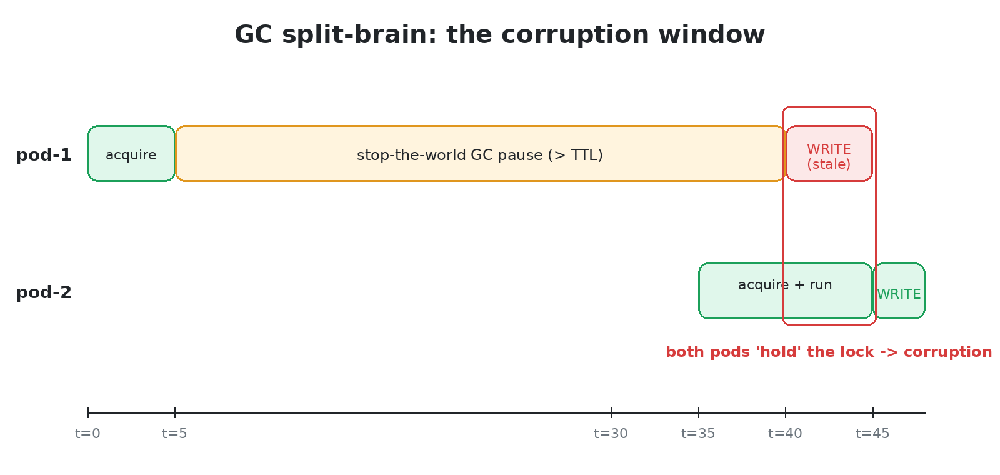
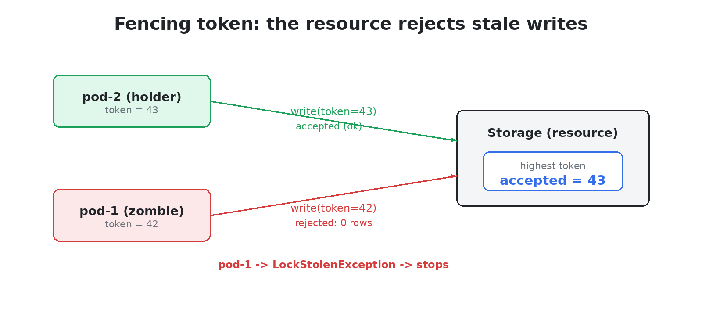
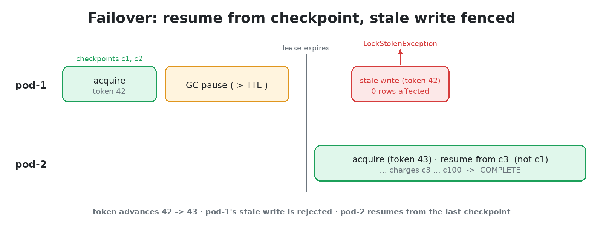
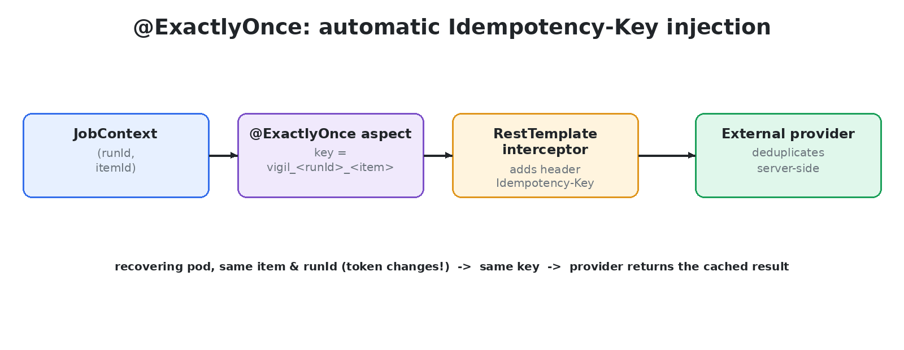
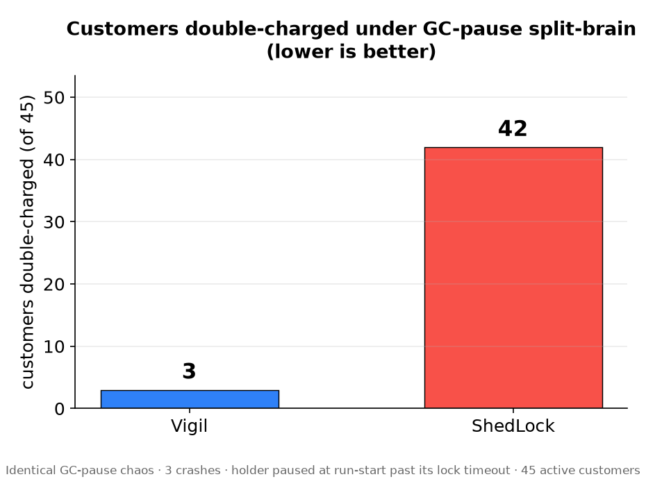

<div align="center">

# Vigil

**Exactly-once scheduled jobs for Spring Boot, with fencing tokens, crash-resume, and GC-pause safety.**

A distributed lock and scheduler built on the assumption that your pod *will* freeze, get killed, or lose the database, and that your jobs must stay correct anyway.

[](https://openjdk.org/projects/jdk/21/)
[](https://spring.io/projects/spring-boot)
[](#installation)

</div>

```java
@FencedScheduled(name = "nightly-billing", cron = "0 0 2 * * *")
public void runBilling() {
    billing.chargeAllDueAccounts();
}
```

One dependency and one annotation. The job runs on exactly one instance. When that instance freezes past its lease and another takes over, the frozen one is **rejected by the database** the moment it wakes up, instead of quietly charging your customers a second time.

Under identical GC-pause chaos against 45 customers: **ShedLock double-charged 42, Vigil double-charged 3, and 0 with idempotency keys enabled.** See [Correctness evidence](#correctness-evidence).

---

<details>
<summary><strong>Table of contents</strong></summary>

1. [The problem](#the-problem)
2. [What Vigil does about it](#what-vigil-does-about-it)
3. [Requirements](#requirements)
4. [Installation](#installation)
5. [Quick start](#quick-start)
6. [Writing jobs](#writing-jobs)
7. [Crash-resume with checkpoints](#crash-resume-with-checkpoints)
8. [Exactly-once side effects](#exactly-once-side-effects)
9. [Backends](#backends)
10. [Database schema](#database-schema)
11. [Configuration reference](#configuration-reference)
12. [Operations and observability](#operations-and-observability)
13. [How it works](#how-it-works)
14. [Guarantees, and what they are not](#guarantees-and-what-they-are-not)
15. [Correctness evidence](#correctness-evidence)
16. [Vigil compared to ShedLock and Quartz](#vigil-compared-to-shedlock-and-quartz)
17. [Module map](#module-map)
18. [Building from source](#building-from-source)
19. [Writing your own backend](#writing-your-own-backend)
20. [Troubleshooting](#troubleshooting)
21. [Roadmap](#roadmap)
22. [Feedback](#feedback)

</details>

---

## The problem

You run a Spring Boot service on more than one instance. You have a `@Scheduled` job: a nightly billing run, a settlement, a report, a cleanup. It must run on exactly one instance.

So you reach for a lease-based lock such as [ShedLock](https://github.com/lukas-krecan/ShedLock). It works, and you move on.

Here is what a lease alone does not protect you from:

> Instance **A** acquires the lock and starts the job. Mid-run its JVM enters a 12 second stop-the-world GC pause. The lease expires. Instance **B** sees a free lock, takes over, and starts the same job. Then **A** wakes up. It has no idea that time passed, and it finishes its own run too.

The job now ran twice, concurrently. Two instances charged the same customers, sent the same emails, wrote the same rows. A lock that only answers the question *"is somebody holding this right now?"* cannot prevent this, because at the moment A wakes up and continues, nobody asked it anything.

The general form of the problem: **a lease can expire without the holder finding out**. Any pause longer than the lease (GC, VM steal time, a container freeze, a network partition to the lock store, a suspended process) turns a healthy-looking holder into a zombie that still believes it owns the job.



## What Vigil does about it

Vigil pairs the lease with a **monotonically increasing fencing token**, the pattern described in Martin Kleppmann's [How to do distributed locking](https://martin.kleppmann.com/2016/02/08/how-to-do-distributed-locking.html), and carries that token all the way through to every write.



Every acquisition of a job's lock increments the token. Every subsequent operation by the holder (renewal, checkpoint write, checkpoint cleanup, release) is conditioned on that token still being the current one, in the same atomic operation as the write itself. A zombie instance holding token `N` after a takeover bumped the row to `N+1` therefore updates zero rows. It cannot renew, it cannot record progress, and it cannot corrupt the state that the new holder is working from. It finds out that it lost, and its job thread is interrupted.

That is the core idea. Around it, Vigil adds what you need to actually operate such jobs:

- **Fenced distributed lock.** One holder per job name, with a token that never goes backwards.
- **Heartbeat auto-renewal.** A live job keeps its lock indefinitely. The TTL is a death-detection timeout, not a job-duration limit.
- **Self-fencing.** If renewals fail or throw for longer than the TTL (a partition to the lock store, for example), the holder assumes it lost the lock and interrupts its own job thread rather than continuing blind.
- **Crash-resume with checkpoints.** A job that dies at item 8,000 of 10,000 resumes at 8,000 on another instance, not at zero. Checkpoint writes are fencing-guarded, so a zombie cannot rewind or overwrite them.
- **Self-cleaning checkpoints.** When a run completes successfully, its checkpoints are deleted, under a fencing guard. Storage stays proportional to in-flight runs, not to runs ever executed.
- **Orphan detection.** Expired and orphaned locks are picked up promptly instead of waiting for the next scheduled tick, which cuts failover time substantially.
- **`@ExactlyOnce` idempotency keys.** A deterministic, failover-stable key derived from the run and the item, injected into outbound HTTP calls so a payment provider or downstream service can deduplicate the boundary case.
- **Drop-in scheduling.** `@FencedScheduled` with cron or fixed-rate, in place of `@Scheduled`, plus a programmatic builder.
- **Observability.** An Actuator endpoint, a health indicator, and Micrometer metrics, wired automatically.
- **Your existing database.** No ZooKeeper, no extra infrastructure. PostgreSQL, MySQL/MariaDB, SQL Server, Oracle, MongoDB, Redis, and DynamoDB.
- **Verified, not just asserted.** A shared contract-test suite every backend must pass identically, JVM-level chaos tests, container-level chaos scenarios, and a TLA+ model of the lock protocol.

---

## Requirements

| | |
|---|---|
| Java | 21 or newer |
| Spring Boot | 3.x (built and tested against 3.3.7) |
| Store | one of PostgreSQL, MySQL/MariaDB, SQL Server, Oracle, MongoDB, Redis, DynamoDB |
| Optional | `spring-boot-starter-actuator` for the endpoint, health indicator, and metrics |
| Optional | Flyway, if you want Vigil's schema managed as versioned migrations |

## Installation

Vigil is at `0.1.0-SNAPSHOT` and is not yet published to Maven Central. Build and install it into your local repository first:

```bash
git clone <repository-url> vigil
cd vigil
export JAVA_HOME=/path/to/jdk-21
mvn install -DskipTests -Djacoco.skip=true
```

Then add the starter to your application:

```xml
<dependency>
    <groupId>io.vigil</groupId>
    <artifactId>vigil-spring-boot-starter</artifactId>
    <version>0.1.0-SNAPSHOT</version>
</dependency>
```

The starter brings in the autoconfiguration, the JDBC backend, and the Actuator integration. To use a different store, see [Backends](#backends).

On Spring Boot, autoconfiguration is picked up automatically and no annotation is required. In a plain Spring context, add `@EnableVigil` to a configuration class.

## Quick start

```java
@Component
public class BillingJobs {

    private final BillingService billing;

    public BillingJobs(BillingService billing) {
        this.billing = billing;
    }

    @FencedScheduled(name = "nightly-billing", cron = "0 0 2 * * *")
    public void runBilling() {
        billing.chargeAllDueAccounts();
    }
}
```

That is a complete, working job. There is nothing else to configure on PostgreSQL or MySQL: Vigil creates its own tables at startup, either through Flyway if you use it or with plain DDL if you do not (see [Database schema](#database-schema)).

To confirm it is working across a cluster, start two instances and watch the logs. Exactly one reports `[Vigil] Job 'nightly-billing' completed in Nms`, and the other reports `[Vigil] Job 'nightly-billing' skipped - lock held by another pod`. If you have Actuator exposed, `GET /actuator/vigil-jobs` names the holder and its current fencing token.

From here:

- The job is longer than a few minutes, or expensive to repeat, so it should survive a crash: [Crash-resume with checkpoints](#crash-resume-with-checkpoints).
- The job moves money or sends messages: [Exactly-once side effects](#exactly-once-side-effects).
- You are not on PostgreSQL or MySQL: [Backends](#backends).
- You want to know exactly what is and is not guaranteed before trusting it: [Guarantees, and what they are not](#guarantees-and-what-they-are-not).

---

## Writing jobs

### The annotation

```java
@FencedScheduled(
    name           = "settlement",        // required, unique per job, used as the lock key
    cron           = "0 30 1 * * *",      // Spring cron expression
    fixedRateMs    = -1,                  // alternative to cron, in milliseconds
    zone           = "Europe/Tbilisi",    // time zone for the cron expression, default "UTC"
    lockTtlSeconds = 600,                 // failover window for this job, default 300
    warnOnSkip     = false                // log at INFO when another instance holds the lock, default true
)
public void settle() { }
```

Rules and notes:

- `name` is the lock key. Two methods with the same name contend for the same lock, across every instance of the application.
- Provide either `cron` or `fixedRateMs`. If neither is set, the job is registered but never triggers, and Vigil logs a warning at startup.
- `zone` applies to `cron` only.
- `lockTtlSeconds` is how long a *dead* holder's lock stays unavailable to others, not a limit on how long the job may run. A live job renews continuously.
- `warnOnSkip = true` logs at INFO on every tick that finds the lock held elsewhere. On a short fixed-rate job across many instances, set it to `false`.
- The annotated method may be package-private. Vigil makes it accessible, matching `@Scheduled` behavior.

### Programmatic registration

Define a `VigilJobDefinition` bean when the schedule is not known at compile time:

```java
@Bean
public VigilJobDefinition reconciliationJob(ReconciliationService service) {
    return VigilJobDefinition.define("reconciliation")
            .cron("0 0 * * * *")
            .zone("UTC")
            .lockTtlSeconds(900)
            .warnOnSkip(false)
            .run(ctx -> service.reconcile(ctx));
}
```

`run` accepts either a `Consumer<JobContext>` or a `Runnable`.

### Guarding helpers that must run inside a job

Annotate a method with `@RequiresJobContext` and it throws `IllegalStateException` if it is ever called outside a running `@FencedScheduled` job. Useful for a service method that is only safe under a held lock.

```java
@RequiresJobContext
public void applyLedgerAdjustment(Adjustment adjustment) { }
```

### Reacting to job lifecycle events

Register a `VigilJobLifecycleListener` bean to observe what the scheduler is doing. Every method has a default implementation, so override only what you need.

```java
@Component
public class JobAudit implements VigilJobLifecycleListener {
    @Override public void onLockStolen(String jobName) { alerting.warn("lock stolen: " + jobName); }
    @Override public void onFailoverRecovery(String jobName) { alerting.info("resumed: " + jobName); }
}
```

Available callbacks: `onLockAcquired`, `onLockSkipped`, `onLockStolen`, `onJobCompleted(name, status, durationMs)`, `onItemProcessed`, `onCheckpointSaved`, `onFailoverRecovery`.

---

## Crash-resume with checkpoints

Declare a `JobContext` parameter and structure the job in stages. Vigil records progress after each item, guarded by the fencing token. When an instance dies mid-run, the next instance to acquire the lock reuses the same `runId` and skips what was already done.



```java
enum Stage { PREPARE, SETTLE, REPORT }

@FencedScheduled(name = "settlement", cron = "0 30 1 * * *", lockTtlSeconds = 600)
public void settle(JobContext ctx) {

    ctx.step(Stage.PREPARE, () -> ledger.openBatch());

    ctx.forEach(Stage.SETTLE, accounts.findDueIds(), Function.identity(), (accountId, token) -> {
        settlementService.settle(accountId, token);
    });

    ctx.step(Stage.REPORT, () -> reporting.publishSummary());
}
```

### The `JobContext` API

| Method | Purpose |
|---|---|
| `step(stage, Supplier<T>)` | Run a stage once and checkpoint its return value. On resume the stored value is returned instead of re-running the stage. |
| `step(stage, Runnable)` | Run a stage once, with no stored value. Skipped entirely on resume. |
| `forEach(stage, items, idFn, action)` | Iterate a list with per-item progress. On resume, items whose id sorts at or below the last recorded id are skipped. `action` is either `Consumer<T>` or `BiConsumer<T, Long>`, where the `Long` is the current fencing token. |
| `forEachWithState(stage, items, idFn, initial, action)` | Same, folding a state value that is checkpointed alongside progress. `action` is `BiFunction<T, S, S>` or `TriFunction<T, Long, S, S>`. |
| `forEachPage(stage, pageLoader, idFn, action)` | Cursor-paginated iteration for data sets too large to hold in memory. `pageLoader` receives `Optional<String>` (the last processed id) and returns the next page, or an empty list to finish. |
| `forEachPageWithState(stage, pageLoader, idFn, initial, action)` | Paginated iteration with a folded state value. |
| `isStageComplete(stage)` / `completeStage(stage)` | Inspect and mark stage completion manually. |
| `getFencingToken()` | The token for this run. Pass it to any side effect that can validate it. |
| `getRunId()` | The run identifier. Stable across failover, which is what makes resume and idempotency keys work. |
| `isResume()` | True when this execution picked up an interrupted earlier run. |
| `getItemsProcessed()` | Items processed by this execution. |
| `assertStillHeld()` | Actively verify the lock is still held, throwing `LockStolenException` if not. Call it before an expensive or irreversible block. |

`JobContext.current()` returns the context bound to the current thread, for code that cannot take it as a parameter.

### Two rules that matter

**1. Item ids must sort correctly.** Resume works by comparing `itemId.compareTo(lastId)` as strings. Ids must be lexicographically ordered in the same order you iterate them, and the iteration order must be stable across runs. Zero-pad numeric ids (`"000123"`, not `"123"`), or use ULIDs, sorted UUIDs, or timestamps. An unsorted or unstable order means resume skips the wrong items.

**2. Checkpoint values are deliberately restricted.** Anything you hand to `step` or use as fold state must be one of:

- a primitive or its wrapper, `String`, `UUID`, `LocalDate`, `LocalDateTime`, `Instant`
- an enum
- a Java `record` whose components are, recursively, all of the above

Collections, maps, arrays, and ordinary classes are rejected at runtime with a `CheckpointTypeException` that names the offending field path. This is intentional: a checkpoint is a resume cursor, not a cache. Storing a `List` in a checkpoint means storing a snapshot of your data in the lock store, where it goes stale and grows without bound.

So this fails:

```java
List<Account> due = ctx.step(Stage.LOAD, () -> accounts.findDue());   // CheckpointTypeException
```

and the correct shapes are:

```java
// Load outside a step, checkpoint only a cursor or a count.
long expected = ctx.step(Stage.PREPARE, () -> accounts.countDue());
List<String> dueIds = accounts.findDueIds();
ctx.forEach(Stage.SETTLE, dueIds, Function.identity(), id -> settle(id));

// Or stream the data set page by page and never hold it in memory at all.
ctx.forEachPage(Stage.SETTLE,
        cursor -> accounts.findDueAfter(cursor.orElse(""), 500),
        Account::id,
        (account, token) -> settlementService.settle(account, token));

// Fold state must be a record of scalars.
record Totals(long charged, long failed) {}
Totals totals = ctx.forEachWithState(Stage.SETTLE, dueIds, Function.identity(),
        new Totals(0, 0),
        (id, t) -> settle(id) ? new Totals(t.charged() + 1, t.failed())
                              : new Totals(t.charged(), t.failed() + 1));
```

### When resume happens, and when it does not

Resume happens **only on failover**: when the lock is acquired from an `ORPHANED` or expired state, in which case the existing `runId` is reused and the previous run's checkpoints apply.

A clean `release()` (a normal completed run, or a graceful shutdown) sets the lock free, and the next acquisition mints a fresh `runId`. That is a new run, and it starts from the beginning. This is by design: a scheduled tick is a new run, and resume exists for crash recovery only. It also means a graceful rolling deploy mid-job leads to reprocessing on the next tick, which is safe under the at-least-once plus idempotency-key model described below.

---

## Exactly-once side effects

Checkpoints stop a zombie from making *forward progress*, but the side effect for the item that was in flight when it froze may already have fired. For non-idempotent effects (charging a card, sending an email) you need the receiver to help.



`@ExactlyOnce` binds a deterministic idempotency key for the duration of the annotated method:

```java
@ExactlyOnce
public void chargeCard(String accountId, long amount) {
    restTemplate.postForEntity(gatewayUrl, new ChargeRequest(accountId, amount), Void.class);
}
```

What actually happens:

1. The method must be called from inside a `forEach` / `forEachPage` lambda, so an item context exists. Called outside one, Vigil logs a warning and proceeds without a key.
2. Vigil computes the key `vigil_<runId>_<itemId>_<Class.method>`. Because `runId` is reused across failover, the same logical item produces the same key on the instance that took over as on the instance that died.
3. The key is bound to the current thread, and any `RestTemplate` built from Spring's auto-configured `RestTemplateBuilder` sends it as both `Idempotency-Key` and `X-Idempotency-Key` headers.
4. The provider deduplicates. Stripe, Adyen, and most payment APIs honor `Idempotency-Key`.

Two honest limitations, which Vigil also warns about at startup:

- **The guarantee is cooperative.** If the receiver ignores the header, you have at-least-once, not exactly-once. Vigil cannot make a remote system idempotent.
- **The key lives in a `ThreadLocal`.** With `spring.threads.virtual.enabled=true`, or any async hand-off inside the annotated method, the key does not propagate. Vigil logs this at startup when it detects the combination.

For a non-HTTP effect, read the key yourself and use it as a unique constraint or dedupe row:

```java
@ExactlyOnce
public void publish(Event event) {
    String key = HttpIdempotencyContext.current().value();
    outbox.insertIgnoringDuplicates(key, event);
}
```

`ExactlyOnceContext.current()` gives access to the raw `runId`, `fencingToken`, and `itemId` if you want to build your own key.

---

## Backends

All backends implement the same two SPIs and are verified against the same contract suite: mutual exclusion, monotonic tokens, stale-token rejection, run-id reuse on failover, connectivity probing, checkpoint save and load, fencing-guarded checkpoint writes, and fencing-guarded cleanup.

### Choosing one

The backend is selected by **which Vigil module is on the classpath**, combined with which driver bean exists in your context. The starter includes `vigil-jdbc`, so a JDBC backend is the default. To use another store, exclude it and add the one you want:

```xml
<dependency>
    <groupId>io.vigil</groupId>
    <artifactId>vigil-spring-boot-starter</artifactId>
    <version>0.1.0-SNAPSHOT</version>
    <exclusions>
        <exclusion>
            <groupId>io.vigil</groupId>
            <artifactId>vigil-jdbc</artifactId>
        </exclusion>
    </exclusions>
</dependency>
<dependency>
    <groupId>io.vigil</groupId>
    <artifactId>vigil-redis</artifactId>
    <version>0.1.0-SNAPSHOT</version>
</dependency>
```

The four relational databases are not separate modules. They all use `vigil-jdbc` and differ only by a SQL dialect that Vigil resolves at startup from `DatabaseMetaData.getDatabaseProductName()`.

> Note: `spring.vigil.backend` exists as a property and accepts `AUTO`, `JDBC`, `REDIS`, `MONGO`, `DYNAMODB`, but the current wiring does not read it. Selection is entirely by classpath and available driver bean. Setting it has no effect today.

### Per-backend requirements

| Backend | Driver bean required | Clock used for expiry | Operational requirements |
|---|---|---|---|
| PostgreSQL | `JdbcTemplate` | database, `CURRENT_TIMESTAMP` | Reference implementation. Nothing special. |
| MySQL / MariaDB | `JdbcTemplate` | database, `CURRENT_TIMESTAMP(3)` | Timestamp columns must be `DATETIME(3)`. Second-granularity columns break takeover timing. |
| SQL Server | `JdbcTemplate` | database, `SYSUTCDATETIME` | Schema must be created manually. See [Database schema](#database-schema). |
| Oracle | `JdbcTemplate` | database, `SYS_EXTRACT_UTC(SYSTIMESTAMP)` | Schema must be created manually. `stored_value` must be `VARCHAR2(4000)`, not `CLOB`. |
| MongoDB | `MongoDatabaseFactory` | database | **Requires a replica set.** The checkpoint fencing guard uses a multi-document transaction. TTL indexes are not relied on for correctness, since eviction is lazy; expiry is an explicit `expires_at` comparison. |
| Redis | `StringRedisTemplate` | Redis server `TIME` | **Enable persistence (AOF or RDB).** A flush loses locks and in-flight checkpoints. All fencing logic is in Lua scripts, so it is atomic on the server. Checkpoints have no TTL and are deleted when their run completes. |
| DynamoDB | `DynamoDbClient` | **client wall clock** | DynamoDB has no server clock, so expiry uses the caller's `Instant.now()`. Keep instance clocks in NTP sync. The fencing guard uses strongly consistent reads and `TransactWriteItems`. Tables must be created manually. |

Why the clock column matters: every other backend evaluates expiry using a single authoritative clock, which makes clock skew between application instances irrelevant. DynamoDB cannot, so skew between instances directly widens or narrows the effective failover window there.

---

## Database schema

Vigil uses three tables on the relational backends: `vigil_job_locks`, `vigil_job_checkpoints`, and `vigil_job_runs`.

There are three ways they get created.

**1. Flyway, if Flyway is on the classpath.** Vigil appends `classpath:io/vigil/db/migration/{vendor}` to your Flyway locations, so its migrations (`V100`, `V101`, `V102`, `V103`) run alongside yours. Migrations are supplied for `postgresql` and `mysql`.

**2. Automatic DDL, if Flyway is not on the classpath.** `VigilSchemaInitializer` issues `CREATE TABLE IF NOT EXISTS` at startup. It has a PostgreSQL-compatible default and a MySQL-specific variant.

**3. Manually, for SQL Server, Oracle, and DynamoDB.** Neither automatic path covers these. `CREATE TABLE IF NOT EXISTS` and `TEXT` are not valid on SQL Server or Oracle, so apply DDL yourself as part of your own migration process. The column shapes are:

| Table | Columns |
|---|---|
| `vigil_job_locks` | `job_name` PK, `run_id`, `holder`, `token` bigint, `acquired_at`, `expires_at`, `status` in (`FREE`, `HELD`, `ORPHANED`, `PAUSED`), plus an index on `(expires_at, status)` |
| `vigil_job_checkpoints` | PK `(job_name, run_id, stage_name)`, `status`, `stored_value` text, `value_type`, `fencing_token` bigint, `updated_at`, plus an index on `(job_name, run_id)` |
| `vigil_job_runs` | PK `(job_name, run_id)`, `started_at`, `finished_at`, `status`, `items_processed` bigint, `error_message` |

For reference implementations, see `vigil-spring-boot-autoconfigure/src/main/resources/io/vigil/db/migration/`, the DDL constants in `VigilSchemaInitializer`, and the vendor-specific DDL used by the contract tests in `vigil-jdbc/src/test/java/`.

MongoDB creates its collections implicitly. DynamoDB needs a lock table and a checkpoint table (partition key `job_name`, sort key `ckpt_key`) created ahead of time.

---

## Configuration reference

All properties live under `spring.vigil`.

| Property | Default | Description |
|---|---|---|
| `spring.vigil.enabled` | `true` | Master switch. When `false`, none of Vigil's beans are created and no job runs. |
| `spring.vigil.pod-id` | random UUID per process | Identifier written into the `holder` column. Set it to something meaningful, such as `${HOSTNAME}` or the Kubernetes pod name, so the Actuator endpoint tells you which instance holds a job. |
| `spring.vigil.lock-ttl-seconds` | `300` | Default lease length and therefore the default failover window. Overridable per job. |
| `spring.vigil.checkpoint-size-limit-kb` | `10` | Intended cap on serialized checkpoint payload size. Present in configuration but not currently enforced by the write path. |
| `spring.vigil.orphan-scan-interval-ms` | `30000` | How often to scan for expired and orphaned locks. Lower means faster failover and more queries. JDBC backends only. |
| `spring.vigil.run-history-retention` | `100` | Runs kept per job in `vigil_job_runs`. JDBC backends only. |
| `spring.vigil.run-history-cleanup-interval-ms` | `3600000` | How often run history is purged. JDBC backends only. |
| `spring.vigil.backend` | `AUTO` | Reserved. Not read by the current wiring, see [Choosing one](#choosing-one). |

### Choosing a TTL

The TTL is the answer to a single question: *if an instance dies without releasing, how long may this job stay stuck before another instance may take over?*

- Too short, and a long GC pause or a slow lock-store round trip causes needless takeovers. Correctness holds (fencing sees to that), but you get churn and wasted work.
- Too long, and a genuine crash leaves the job frozen for that long. The orphan detector shortens this considerably in practice for JDBC backends, because a crashed process's lock is normally marked `ORPHANED` or found expired and picked up on the next scan rather than at the next scheduled tick.

Start with the default 300 seconds, and raise it for jobs with long non-interruptible sections. Vigil also ships a TTL advisor that watches actual run durations and logs a warning once per job when the peak observed runtime exceeds half the configured TTL.

---

## Operations and observability

With `spring-boot-starter-actuator` on the classpath, expose the endpoint:

```properties
management.endpoints.web.exposure.include=health,metrics,vigil-jobs
```

### The `vigil-jobs` endpoint

Requires a `JdbcTemplate`, since it reads Vigil's relational tables directly. It is not available on the Redis, MongoDB, or DynamoDB backends.

```
GET    /actuator/vigil-jobs
```

Returns one entry per job: name, lock status, holder, current token, run id, last checkpointed stage, checkpoint timestamp, next trigger time, last run duration, and last error.

```
POST   /actuator/vigil-jobs/{name}      body: {"action": "trigger" | "pause" | "resume"}
```

- `trigger` submits an immediate recovery run for that job.
- `pause` sets the lock row to `PAUSED`, which prevents any instance from acquiring it.
- `resume` clears `PAUSED` and submits a run.

```
DELETE /actuator/vigil-jobs/{name}/{confirm}/{resource}
```

`resource` is `lock` or `checkpoint`, and `confirm` must be the literal string `true`, otherwise the call is a no-op. Clearing a lock forcibly frees a job whose holder is gone; clearing checkpoints discards resume state so the next run starts clean. Both are administrative escape hatches, so use them deliberately.

### Health

A `vigilLock` health indicator is contributed to `/actuator/health` whenever a `FencedLock` bean exists. It calls `checkConnectivity()` on the active backend (a JDBC `Connection.isValid`, a Redis `PING`, a Mongo count, a DynamoDB `DescribeTable`) and reports `UP` or `DOWN` with the backend name, so losing the lock store shows up in the health checks you already monitor.

### Metrics

Micrometer meters, registered when a `MeterRegistry` exists:

| Meter | Type | Meaning |
|---|---|---|
| `vigil.lock.acquisitions.total` | counter | Lock acquisition attempts, tagged by outcome |
| `vigil.lock.stolen.total` | counter | Times a holder discovered it had been fenced out |
| `vigil.job.executions.total` | counter | Completed runs, tagged by status |
| `vigil.job.duration.seconds` | timer | Run duration |
| `vigil.job.items.processed.total` | counter | Items processed inside `forEach` variants |
| `vigil.checkpoint.saves.total` | counter | Checkpoint writes |
| `vigil.failover.recoveries.total` | counter | Runs that resumed an interrupted earlier run |

`vigil.lock.stolen.total` and `vigil.failover.recoveries.total` are the two worth alerting on. Both being persistently non-zero means instances are dying or freezing regularly, and Vigil is doing its job while something upstream needs attention.

### Log lines worth knowing

All Vigil logging is prefixed `[Vigil]`.

| Message | Meaning |
|---|---|
| `Job 'x' skipped - lock held by another pod` | Normal in a cluster. Silence per job with `warnOnSkip = false`. |
| `Job 'x' stopped - lock stolen (token=N)` | This instance was fenced out mid-run and its job thread was interrupted. Another instance owns the run. |
| `Lock renewal failed for job 'x' ... stolen, interrupting job thread` | The heartbeat found the token superseded. |
| `Cannot renew lock for job 'x' ... (>= ttl)` | Renewals have been failing or throwing for longer than the TTL. Vigil self-fences and interrupts the job. Normally a partition to the lock store. |
| `Orphan detected for job 'x', submitting recovery` | Failover in progress. |
| `Job 'x' peak recent runtime is Nms but lockTtlSeconds=Ns` | The TTL advisor thinks the TTL is too tight for this job. |
| `@ExactlyOnce ... called outside a forEach context` | The annotation had no item context, so no key was injected. Move the call inside the loop lambda. |

---

## How it works

### The lock protocol

```
tryAcquire(job, podId, ttl)
    atomic compare-and-set on the job row:
        acquirable if status = FREE, or status = ORPHANED, or expires_at < now
        never acquirable if status = PAUSED
    on success:
        token       := token + 1
        holder      := podId
        expires_at  := now + ttl
        status      := HELD
        run_id      := reused if this was a failover, fresh otherwise
    returns LockAcquisition(fencingToken, runId)

tryRenew(job, token, ttl)
    UPDATE ... SET expires_at = now + ttl
    WHERE job = ? AND token = ? AND expires_at >= now
    zero rows affected means either superseded or already expired, so renewal fails

release(job, token)
    UPDATE ... SET status = FREE
    WHERE job = ? AND token = ?
```

Two details carry most of the weight. First, acquisition is a single atomic operation on every backend (a conditional `UPDATE` on JDBC, a Lua script on Redis, `findOneAndUpdate` on Mongo, a conditional write with a re-asserted read token on DynamoDB), never a read followed by a separate write. Second, `now` comes from the store's own clock everywhere except DynamoDB, which eliminates clock skew between application instances as a source of premature stealing.

Note that `tryRenew` also requires the lease to be unexpired. A holder that comes back from a long pause cannot resurrect a lease that has already lapsed, even if nobody else has taken it yet. It must go through `tryAcquire` and get a new token.

### The run lifecycle

```
tick fires
  |
  +- tryAcquire fails      -> skip, log, done
  |
  +- tryAcquire succeeds   -> register with the heartbeat daemon
                              bind a JobContext (runId, token, resume flag)
                              invoke the job method
                                 checkpoint writes are guarded by token
                                 heartbeat renews at min(ttl)/3 across registered jobs
                              re-verify the lock after the method returns
                                 lost -> outcome STOLEN, no cleanup, no release
                                 held -> outcome SUCCESS
                              on SUCCESS, clear this run's checkpoints (guarded by token)
                              deregister the heartbeat, release the lock
```

The post-run re-verification matters: a run that completed its work but lost the lock somewhere in the middle is recorded as `STOLEN`, not `SUCCESS`, and its checkpoints are deliberately left alone so that whoever took over can still resume from them.

### Why a zombie cannot cause damage

Trace an instance that freezes for longer than the TTL:

1. **A** holds the job at token `N`. It freezes.
2. Its lease expires. The orphan detector or the next tick lets **B** call `tryAcquire`, which atomically bumps the token to `N+1` and reuses the same `runId`.
3. **B** resumes from **A**'s last checkpoint and continues.
4. **A** wakes up, unaware that anything happened, and tries to continue.
   - Its next checkpoint write carries token `N`. Every backend's write path re-checks the current lock token in the same atomic operation, sees `N+1`, and rejects the write with `LockStolenException`. Progress cannot be rewound and stale state cannot be committed.
   - Its next heartbeat renewal at token `N` matches nothing, so the daemon interrupts **A**'s job thread.
   - Its `release` at token `N` matches nothing, so it cannot free **B**'s lock.
   - Its checkpoint cleanup at token `N` matches nothing, so it cannot delete the state **B** is resuming from.

The window in which **A** and **B** are both executing is real and cannot be eliminated by any lock, since **A** is a frozen process that cannot be signaled. What Vigil eliminates is the ability of that window to produce durable damage. The only escape is a side effect **A** fired between waking up and its next fenced write, which is exactly the case [`@ExactlyOnce`](#exactly-once-side-effects) exists to cover.

---

## Guarantees, and what they are not

Being precise here is more useful than being impressive.

**What Vigil guarantees**

- At most one instance holds a given job's lock at any point in time, as observed by the store.
- Fencing tokens are strictly monotonic per job. A token is never reused or reissued.
- No instance holding a stale token can commit a checkpoint, renew a lease, release a lock, or delete checkpoints.
- After a crash or a fenced-out instance, another instance resumes the same run from the last durably recorded item.
- Checkpoints from a successfully completed run are removed, so checkpoint storage stays proportional to in-flight runs.

**What Vigil does not guarantee**

- **Not mutual exclusion of execution.** Two instances can briefly execute the same job at the same time, during a pause longer than the TTL. No lease-based lock can prevent that. Vigil prevents the consequences, not the overlap.
- **Not exactly-once side effects on its own.** Job code is executed at-least-once at the boundary. Exactly-once for a remote effect requires the receiver to honor the idempotency key.
- **Not resume after a clean release.** Resume happens on failover only. A normal completed run starts fresh next time.
- **Not durability beyond your store.** With Redis persistence disabled, a flush loses locks and checkpoints. Vigil's guarantees are exactly as durable as what they are written to.
- **Not immunity from clock skew on DynamoDB.** Every other backend uses the store's clock. DynamoDB has none, so instance clock synchronization is your responsibility there.
- **Not a job queue.** Vigil coordinates scheduled jobs. It is not a work queue, not a workflow engine, and it does not distribute a single job's items across instances. One instance runs one job at a time.

---

## Correctness evidence

The evidence is in the repository, and it is reproducible.

### Contract tests

`vigil-testkit` defines abstract suites that every backend must extend and pass identically, so no backend can be silently weaker than another:

- `FencedLockContract`, 9 invariants: mutual exclusion, monotonic tokens, expiry takeover, run-id reuse on takeover, renewal rejection for stale tokens, no resurrection of an expired lease, release fencing, seed row behavior, connectivity probing.
- `CheckpointManagerContract`, 7 invariants: save and load, completion tracking, stale-token write rejection, monotonic checkpoint tokens, cleanup with a held token, no cleanup with a stale token.
- `ChaosContract`, 2 scenarios: a 20 round by 16 thread contended acquire that must yield exactly one winner per round with strictly increasing tokens, and a post-failover zombie writer storm where 16 threads write with mixed stale and current tokens, and every stale write must be rejected with no rogue commit.

Wired against real infrastructure through Testcontainers: PostgreSQL, MySQL, Oracle, SQL Server (lock contract), MongoDB, Redis, and DynamoDB via LocalStack. The chaos contract runs against all four distinct concurrency mechanisms (the JDBC conditional update, the Redis Lua script, the Mongo `findOneAndUpdate`, and the DynamoDB read-then-conditional-write).

This suite has already caught real bugs, including a MySQL `CURRENT_TIMESTAMP` second-truncation issue and an Oracle session-timezone skew that made every held lock read as expired.

### Formal verification

`vigil-core/src/main/tla/VigilLock.tla` models the lock and fencing protocol. TLC checks 5 properties over 3 pods, exploring 118 distinct states. `verification/07_tla_check.sh` re-runs the check.

### Chaos and comparison scenarios

`verification/` holds a runnable evidence pack: a docker-compose cluster of 3 Vigil pods and 3 ShedLock pods with a PostgreSQL each, plus scripts that inject real container-level faults and print PASS or FAIL with numbers.

```bash
cd verification
./00_environment.sh --up        # build and start the cluster
./run_all.sh                    # scenarios 00 to 04, roughly 5 to 6 minutes
./run_all.sh --with-benchmark   # plus the head-to-head, another 12 to 15 minutes
./00_environment.sh --down
```



Results recorded in `verification/results/`:

| Measurement | ShedLock | Vigil |
|---|---:|---:|
| Customers double-charged under identical GC-pause chaos (scenario 05) | 42 of 45 | **3 of 45**, and **0 of 45** with the stable idempotency key |
| Split-brain corruption events, JVM-level pause injection | 1000 of 1000 | **0 of 100** |
| Recovery time after freezing the holder (scenario 06) | about 60s (TTL plus next tick) | about 11s (orphan detector) |
| Split-brain with no chaos injected (scenario 02) | 0 | 0 |

Reading the middle row honestly: Vigil's 3 of 45 are the *in-flight item at the moment of each freeze*, the one side effect that had already fired before the fencing guard could reject anything. Every subsequent write from the frozen pod was rejected. Adding the idempotency key closes that last case at the provider, which is what takes it to zero. The scenario-02 result matters as a control: without chaos both are zero, so the benchmark is counting genuine concurrent execution and not ordinary scheduled reruns.

---

## Vigil compared to ShedLock and Quartz

| | ShedLock | Quartz (clustered) | Vigil |
|---|:---:|:---:|:---:|
| Prevents concurrent start | yes | yes | yes |
| Fencing token stops a stale holder | no | no | **yes** |
| Safe under a pause longer than the lease | no | no | **yes** |
| Crash-resume from per-item checkpoints | no | no | **yes** |
| Idempotency key for downstream effects | no | no | **yes** |
| Actuator endpoint and metrics built in | no | partial | **yes** |
| Formal model of the protocol | no | no | **yes** |
| Extra infrastructure required | no | no | no |
| Misfire policies, job persistence, triggers as data | no | **yes** | no |
| Maturity and ecosystem | **mature** | **mature** | early, 0.1.0 |

ShedLock is excellent at what it does, and if all you need is "do not start twice", it is the right tool and it is far more battle-tested. Quartz is a full scheduling platform, and Vigil is not trying to be one. Vigil is for the narrower case where *a stale instance finishing its run would actually hurt*: money moving, messages sending, ledgers writing.

---

## Module map

Ten Maven modules. Take only what you need, or take the starter and get the common set.

| Module | Contents |
|---|---|
| `vigil-core` | The SPIs (`FencedLock`, `CheckpointManager`), domain records, exceptions, checkpoint type validation, and the TLA+ model. No Spring dependency. |
| `vigil-jdbc` | Relational backend, lock and checkpoint store, with the `SqlDialect` resolver covering PostgreSQL, MySQL/MariaDB, SQL Server, and Oracle. |
| `vigil-redis` | Redis backend, lock and checkpoint store, all fencing logic in atomic Lua scripts. |
| `vigil-mongo` | MongoDB backend, `findOneAndUpdate` compare-and-set plus transactions for the checkpoint guard. |
| `vigil-dynamodb` | DynamoDB backend, conditional writes plus `TransactWriteItems`. |
| `vigil-testkit` | The shared contract suites every backend extends. |
| `vigil-scheduler` | `@FencedScheduled`, `JobContext`, heartbeat daemon, orphan detector, `@ExactlyOnce`, run history, TTL advisor. |
| `vigil-actuator` | The `vigil-jobs` endpoint, the health indicator, and the Micrometer metrics. |
| `vigil-spring-boot-autoconfigure` | Backend wiring, schema initialization, Flyway integration, `@EnableVigil`, configuration properties. |
| `vigil-spring-boot-starter` | The single dependency, pulling autoconfigure plus JDBC plus actuator. |

Package layout follows the concern rather than the module, so `io.vigil.lock.*` and `io.vigil.checkpoint.*` each hold one package per store.

## Building from source

```bash
export JAVA_HOME=/path/to/jdk-21          # Java 21 is required, the build fails on older JDKs

mvn install -DskipTests -Djacoco.skip=true   # fast build, no tests
mvn verify                                   # full build, requires Docker for Testcontainers
mvn -pl vigil-core test                      # a single module
mvn -pl vigil-scheduler verify               # scheduler suite, containers required
```

Coverage is gated per module by JaCoCo at 80 percent line coverage, bound to `verify` (`vigil-testkit` is exempt, since it is a test harness). Because the gate is per module and counts only a module's own tests against its own classes, `-pl <module> verify` produces exactly the same coverage result as a full reactor build.

CI (`.github/workflows/ci.yml`) mirrors this: one job compiles the whole reactor and verifies the five container-free modules, and a parallel matrix job runs one cell per store (PostgreSQL and JDBC, MongoDB, Redis, DynamoDB, scheduler). Oracle runs as a separate non-gating job, because the `gvenzl/oracle-free` image is slow and its pull is unreliable.

## Writing your own backend

Two interfaces, both small, both in `vigil-core`:

```java
public interface FencedLock {
    Optional<LockAcquisition> tryAcquire(String jobName, String podId, Duration ttl);
    boolean tryRenew(String jobName, long fencingToken, Duration ttl);
    void release(String jobName, long fencingToken);
    default void ensureSeedRow(String jobName) {}
    default void checkConnectivity() {}
}

public interface CheckpointManager {
    void save(CheckpointEntry entry);
    Optional<CheckpointEntry> load(String jobName, UUID runId, String stageName);
    boolean isComplete(String jobName, UUID runId, String stageName);
    default List<String> listStageNames(String jobName) { return List.of(); }
    default boolean hasAnyCheckpoint(String jobName, UUID runId) { return false; }
    default void clearRun(String jobName, UUID runId, long fencingToken) {}
}
```

Four requirements make an implementation correct:

1. **`tryAcquire` must be atomic.** One operation that tests acquirability and writes the new token together. A read followed by a write allows two acquirers to obtain the same token.
2. **The token must increase on every acquisition** and must never be reused.
3. **`tryRenew` and `release` must be conditioned on the token**, and `tryRenew` must additionally require an unexpired lease so a paused holder cannot resurrect a lapsed one.
4. **`save` and `clearRun` must re-check the current lock token atomically with the write.** This is the fencing guard, and it is the whole point. Reject a stale write by throwing `LockStolenException`.

Then extend the contract suites and point them at your store:

```java
class MyStoreFencedLockContractTest extends FencedLockContract { /* provide the lock */ }
class MyStoreCheckpointContractTest extends CheckpointManagerContract { /* provide the manager */ }
class MyStoreChaosTest extends ChaosContract { /* provide both */ }
```

If all three pass, your backend gives the same guarantees as the built-in ones. Register the bean as a `FencedLock` and a `CheckpointManager`, and the autoconfiguration backs off in favor of it.

## Troubleshooting

**A job never runs.** Check that either `cron` or `fixedRateMs` is set, that `spring.vigil.enabled` is not `false`, and the startup logs for `has neither cron nor fixedRateMs configured`. Also confirm the job is not `PAUSED` in `vigil_job_locks`.

**A job never runs on one particular instance.** That is normal. Another instance holds the lock. Confirm with `GET /actuator/vigil-jobs` and look at `holder`.

**A job runs but always starts from the beginning after a crash.** Resume needs three things: a `JobContext` parameter, `step` or `forEach` usage rather than a plain loop, and a failover acquisition. If the previous run released cleanly (a completed run or a graceful shutdown), there is nothing to resume by design.

**Resume skips the wrong items.** Item ids are compared as strings. `"9"` sorts after `"10"`. Zero-pad numeric ids, or use ids that sort in iteration order.

**`CheckpointTypeException` at runtime.** A checkpoint value is a collection, map, array, or non-record class. The message names the exact field path. Store a cursor or a record of scalars instead.

**`LockStolenException` in the logs.** This instance was fenced out. The system worked. If it happens often, look at GC pauses, lock-store latency, and whether the TTL is too tight, and check the TTL advisor warnings.

**Table or relation does not exist, on SQL Server or Oracle.** Automatic schema creation covers PostgreSQL and MySQL only. Apply the DDL manually. See [Database schema](#database-schema).

**Mongo transaction errors on checkpoint save.** MongoDB must be running as a replica set. A standalone `mongod` cannot serve the multi-document transaction the fencing guard needs.

**Takeovers happen constantly on DynamoDB.** Instance clocks are out of sync. DynamoDB uses the client clock for expiry. Fix NTP.

**`@ExactlyOnce` produces no header.** Either the call is outside a `forEach` lambda (check for the warning at INFO), or the `RestTemplate` was not built from the auto-configured `RestTemplateBuilder`, or virtual threads or an async hand-off broke `ThreadLocal` propagation.

## Roadmap

- [x] JDBC backends with an auto-detected dialect: PostgreSQL, MySQL/MariaDB, SQL Server, Oracle
- [x] MongoDB, Redis, and DynamoDB backends with lock and checkpoint parity
- [x] Shared contract and chaos suites across every backend
- [x] Self-fencing heartbeat and `JobContext.assertStillHeld()`
- [x] Checkpoint cleanup on successful completion
- [x] Health indicator and per-store CI matrix
- [ ] Publish to Maven Central
- [ ] Automatic schema creation for SQL Server and Oracle
- [ ] Honor `spring.vigil.backend` for explicit backend selection
- [ ] Enforce `checkpoint-size-limit-kb` at the write path
- [ ] In-memory test backend and a `@VigilTest` slice for unit-testing jobs without a database
- [ ] Retention sweep for checkpoints left behind by failed runs
- [ ] OpenTelemetry tracing, one span per run
- [ ] Distributed semaphore, N concurrent holders rather than one
- [ ] ShedLock migration adapter

## Feedback

Vigil is young, and the most useful thing you can tell its author is what would have to be true for you to run it in production. Open an issue or start a discussion.
